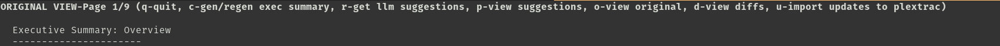
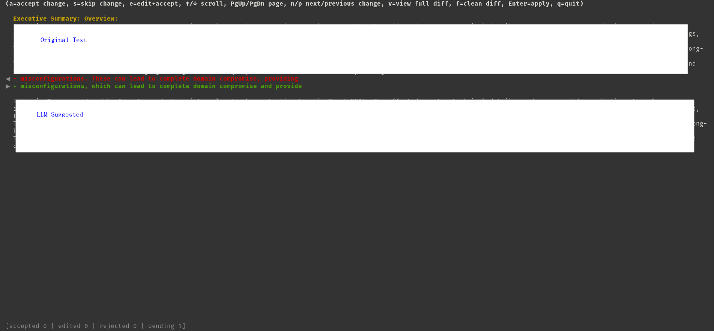

# Tool to assist with peer reviewing of pentest reports

- NLP based suggestions for report edits
- Thanks to Danny Nassre (nassre@gmail.com) for providing the LLM Integration
- See the assets directory for architecture and workflow diagram

Todo's:
- Generate executive summary from a list of findings - In progress
- Check if executive summary matches the report findings
- Unit tests

# Requirements

- cli
- Plextrac account with api access
- if using llama, it expects ollama listening on 127.0.0.1:11434 - adjust as needed
- if using grammarly server should be listening on 127.0.0.0.1:8080 for the Text generation interface (TGI) server, or you can ignore the server specification and just load the model locally without a server
- Python version 3.10

# installation

- pip install -r requirements.txt
- python -m spacy download en_core_web_sm

# Usage

- Ollama server is needed to get llama3.X:instruct text suggestions (either available via http://127.0.0.1:11434 or a remote url)
- Grammarly model can be loaded locally without needing a running server.  It will use the hugging face pipeline to accomplish this.

<code>
PlexTrac CLI Tool

options:
  -h, --help            show this help message and exit
  --server-fqdn SERVER_FQDN PlexTrac server FQDN
  --client-name CLIENT_NAME Client name
  --report-name REPORT_NAME Report name
  --use-llama           Enable Llama for text processing (disabled by default)
  --use-grammarly       Enable Grammarly for text processing (disabled by default)
  --tgi-server-url TGI_SERVER_URL TGI Server URL for Grammarly (default: None) - TGI Server usually listens on 8080
  --ollama-remote-url OLLAMA_REMOTE_URL Ollama server URL (default: None) - Ollama usually listens on 11434
  --use-html-aware-editing Preserve and reinsert inline HTML tags when editing (default: disabled)

</code>

Below is a sample run of the script

1. Run the script given a client and report name.  We are using ollama running locally for LLM suggestions:

<code>peer_review_helper.py  --server-fqdn <plex server> --client-name "ACME Client" --report-name "ACME pentest" --use-llama --ollama-remote-url http://127.0.0.1:11434</code>

Note that once the report is loaded, a ptrac and docx copy will be stored in the directory from which the script is launched.

2. Once you're authenticated, the original report from plextrac is loaded:

   

At this point the report is downloaded and presented to the user in the cli menu.  The user can choose to have the llm generate suggestions:

3. The user presses 'r' to generate a report edited by the LLM.

4. Once the LLM returns the edited report, 'd' can be pressed to just browse the differences the LLM suggested.  Otherwise, press 'u' to enter update mode:

   

5. In this screen, shown in the previous step, each finding change can be edited, accepted as is, or rejected.  The counters on the bottom displace this information.  To cycle thru each suggested change, The user can press n/p.  The up/down arrows can be used to scroll for content that doesn't fit on one page.

