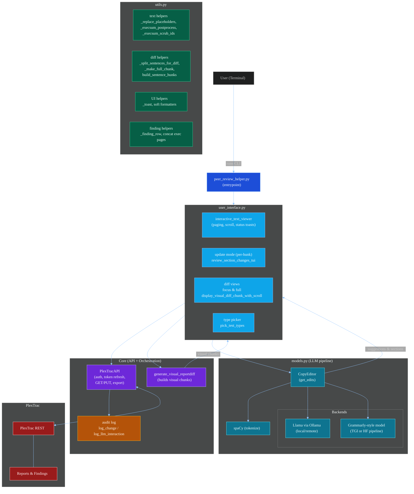
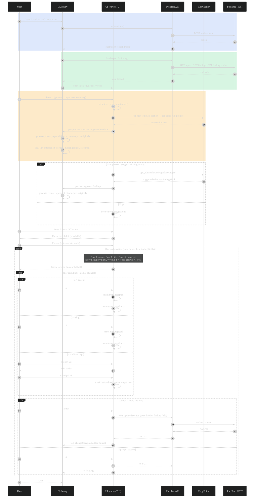

The below diagrams show the architecture of the tool and its review workflow:

```mermaid
%%{init:{
  "theme":"dark",
  "themeVariables":{
    "background":"transparent",
    "primaryTextColor":"#e5e7eb",
    "lineColor":"#93c5fd",
    "fontFamily":"Arial, Helvetica, sans-serif"
  },
  "flowchart":{"htmlLabels":false,"nodeSpacing":45,"rankSpacing":55,"useMaxWidth":true}
}}%%
flowchart TD
  U["User (Terminal)"] -->|runs CLI| CLI["peer_review_helper.py<br/>(entrypoint)"]

  subgraph UI["user_interface.py"]
    IV["interactive_text_viewer<br/>(paging, scroll, status toasts)"]
    UM["update mode (per-hunk)<br/>review_section_changes_tui"]
    DV["diff views<br/>focus &amp; full<br/>display_visual_diff_chunk_with_scroll"]
    TP["type picker<br/>pick_test_types"]
  end

  subgraph CORE["Core (API + Orchestration)"]
    API["PlexTracAPI<br/>(auth, token refresh,<br/>GET/PUT, export)"]
    VDG["generate_visual_reportdiff<br/>(builds visual chunks)"]
    LOG["audit log<br/>log_change / log_llm_interaction"]
  end

  subgraph NLP["models.py (LLM pipeline)"]
    CE["CopyEditor<br/>(get_edits)"]
    SP["spaCy (tokenize)"]
    subgraph LLMs["Backends"]
      LLAMA["Llama via Ollama<br/>(local/remote)"]
      GRAM["Grammarly-style model<br/>(TGI or HF pipeline)"]
    end
    CE --> SP
    CE --> LLAMA
    CE --> GRAM
  end

  subgraph UTIL["utils.py"]
    UT1["text helpers<br/>_replace_placeholders,<br/>_execsum_postprocess,<br/>_execsum_scrub_ids"]
    UT2["diff helpers<br/>_split_sentences_for_diff,<br/>_make_full_chunk,<br/>build_sentence_hunks"]
    UT3["UI helpers<br/>_toast, soft formatters"]
    UT4["finding helpers<br/>_finding_row, concat exec pages"]
  end

  subgraph PT["PlexTrac"]
    PTAPI["PlexTrac REST"]
    DB["Reports &amp; Findings"]
    PTAPI --- DB
  end

  %% Wiring
  CLI --> UI
  UI --> API
  UI --> VDG
  UI --> CE
  API --> LOG
  CE -->|suggestions & sections| UI
  VDG -->|visual chunks| UI
  API <--> PTAPI

  %% Colors
  classDef cli fill:#1d4ed8,stroke:#93c5fd,color:#f9fafb;
  classDef ui fill:#0ea5e9,stroke:#93c5fd,color:#f9fafb;
  classDef core fill:#6d28d9,stroke:#c4b5fd,color:#f9fafb;
  classDef log fill:#b45309,stroke:#fbbf24,color:#fff7ed;
  classDef llm fill:#0e7490,stroke:#67e8f9,color:#ecfeff;
  classDef util fill:#065f46,stroke:#34d399,color:#ecfdf5;
  classDef pt fill:#991b1b,stroke:#fecaca,color:#fff1f2;

  class CLI cli;
  class IV,UM,DV,TP ui;
  class API,VDG core;
  class LOG log;
  class CE,SP,LLAMA,GRAM llm;
  class UT1,UT2,UT3,UT4 util;
  class PTAPI,DB pt;

```

This diagram shows the review workflow:

```mermaid
%%{init:{
  "theme":"dark",
  "themeVariables":{
    "background":"transparent",
    "primaryTextColor":"#e5e7eb",
    "fontFamily":"Arial, Helvetica, sans-serif"
  }
}}%%
sequenceDiagram
  autonumber
  participant User as User
  participant CLI as CLI entry
  participant UI as UI (curses TUI)
  participant API as PlexTracAPI
  participant CE as CopyEditor
  participant PT as PlexTrac REST

  rect rgba(37,99,235,0.15)
    User->>CLI: Launch with server/client/report
    CLI->>API: authenticate()
    API->>PT: POST /authenticate
    PT-->>API: token
    API-->>CLI: start token refresh thread
  end

  rect rgba(34,197,94,0.18)
    CLI->>API: load report & findings
    API->>PT: GET report, GET findings, GET finding bodies
    PT-->>API: payloads
    API-->>CLI: data loaded
    CLI->>UI: open interactive_text_viewer
  end

  rect rgba(245,158,11,0.22)
    User->>UI: Press c (generate / regen exec summary)
    UI->>UI: pick_test_types (multi-select)
    UI->>CE: For each template section → get_edits(full_prompt)
    CE-->>UI: raw section text
    UI->>CLI: postprocess + persist suggested sections
    CLI->>CLI: generate_visual_reportdiff (exec summary vs original)
    CLI->>CLI: log_llm_interaction (section, model, prompt, response)
  end

  alt User presses r (suggest finding edits)
    UI->>CE: get_edits(title/body/guidance/repro)
    CE-->>UI: suggested edits per finding field
    UI->>CLI: persist suggested findings
    CLI->>CLI: generate_visual_reportdiff (findings vs original)
  else Skip
    UI-->>UI: keep current suggestions
  end

  User->>UI: Press d (open diff mode)
  UI-->>User: Focus or full diff (scrollable)

  User->>UI: Press u (enter update mode)

  loop For each section (exec fields, then finding fields)
    Note over UI: Row 0 menu • Row 1 title • Rows 2+ content<br/>n/p = next/prev hunk, v = full, f = focus, arrows = scroll
    UI-->>User: Show focused hunk or full diff

    loop For each hunk (atomic change)
      alt a = accept
        User->>UI: a
        UI->>UI: mark hunk accepted
        UI->>UI: recompute staged text
      else s = skip
        User->>UI: s
        UI->>UI: mark hunk rejected
        UI->>UI: recompute staged text
      else e = edit+accept
        User->>UI: e (open vi)
        UI-->>User: edit buffer
        User->>UI: save/quit vi
        UI->>UI: mark hunk edited, update staged text
      end
    end

    alt Enter = apply section
      User->>UI: Enter
      UI->>API: PUT updated section (exec field or finding field)
      API->>PT: update content
      PT-->>API: 200 OK
      API-->>UI: success
      UI->>CLI: log_change(accepted/edited hunks)
    else q = quit section
      User->>UI: q
      UI-->>API: no PUT
      UI-->>CLI: no logging
    end
  end

  User-->>CLI: Quit

```
